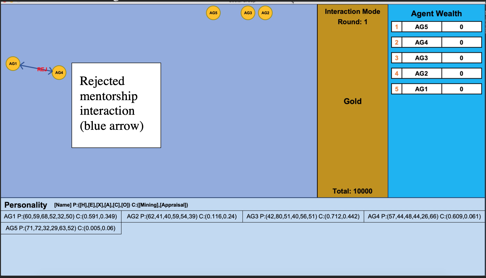
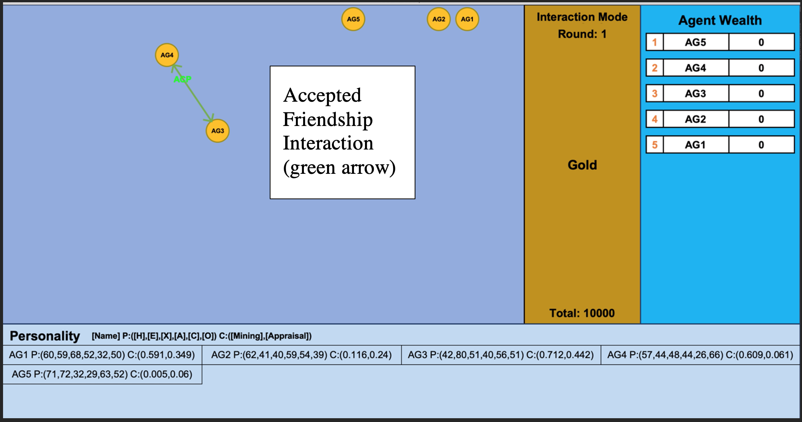
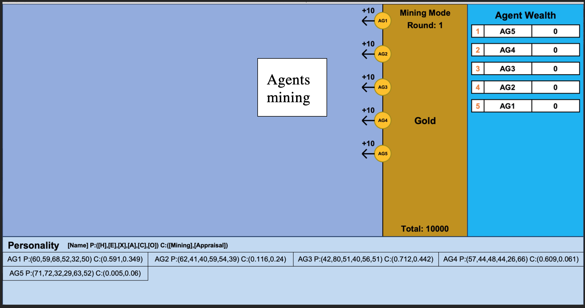
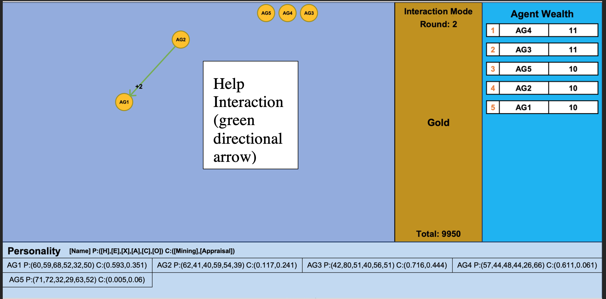
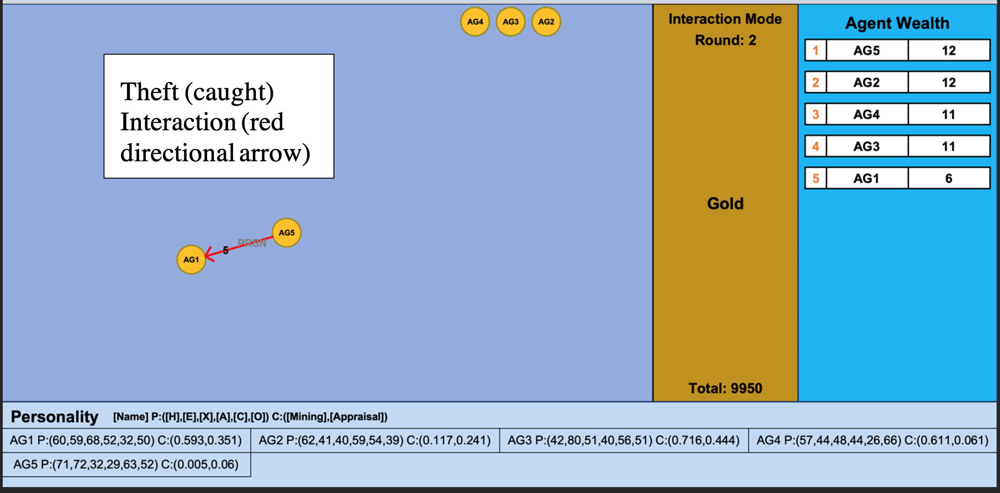
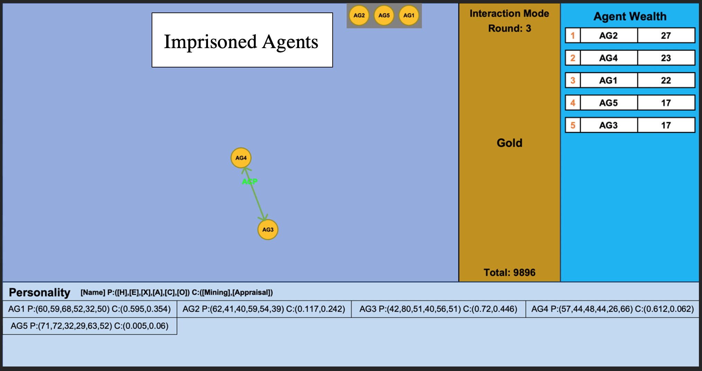

# social-group-simulator

This project is an investigation into the problem of identifying social phenomena, particularly collective action,  social structures formation and power distributions, through the application of the social exchange theory on agents interacting in a Game-theory inspired social environment. 
   **Note:** full write-up of this project can be found in /Dissertation/SimulatingSocialExchangeTheory.pdf

## Project Goals
1. **Simulating the social exchange theory**
   1. Emulating people (via certain characteristics) as intelligent agents
   2. Providing a framework for agents interactions
   3. Developing a social environment for these agents. 
2. **Identifying emergent properties from this simulation.**
   1. Developing detection software to identify social phenomena
   2. Designing an experiment to efficiently search for configurations of agents and simulation settings, where such properties emerge

**Summary**: Project involves simulating people interacting in a game as intelligent agents. In the game, the agents will use their skills to compete for gold. These agents are given the options to mentor, steal from, help and befriend another agent, and this decision will be influenced by the agent’s personality and skill level.  

## Social Exchange Theory
**Definition:**
In sociology, the social exchange theory argues that any social phenomena, e.g. war, marriage and friendship, can be decomposed into a sequence of interactions involving several exchanges.

**Assumptions:** It works on the assumption that human beings are rational and so will act in ways to maximise their gain by weighing up the costs and benefits of certain actions.

**Criticisms:**

1) Do people always act rationally? 
2) How can it explain why people act altruistically and create social structures and norms?

**Project Motivations:** understanding how complicated social behaviour evolves through the application of the Social Exchange Theory and to identify insights on how it can be used to affirm or respond to some of the aforementioned critiques.

## Game Theory: The Social Environment

* The game consists of players competing for gold in an environment containing a mineable gold resource. 
* The game can be played by at least 2 players and consists of multiple rounds. 
* Each round starts with an interaction window, where agents are allowed to interact with each other, and ends with a mining window, where the environment distributes gold to the players based on their mining competency. 
* The goal for the players of the game is to generate as much gold as possible. 

**Type of interactions:**
1. **Friendship**, where each ‘friend’ (player) will be awarded at the end of the mining window with an additional 10% of all of the earnings of the friend in the current round
2. **Mentorship**, where a ‘mentee’ with a lower competency skill than the ‘mentee’ can increase this skill by 15% of skill difference in exchange for 20% of all of its earnings in the current round; 
3. **Help**, where a helper will donate 5% of the money earnt by the beneficiary in the last round to the beneficiary 
4. **Theft**, where a thief can steal 30% of the money earnt by the victim in the last round, but will not be able to participate in the next round if caught.

This game was constructed to emulate the following Social Environment Model[1](#myfootnote1)

## Agents
Agents are designed to emulate people playing this game and have the following attributes:

1. **Personality** represented using the HEXACO model
2. **Mining skill** representing how much gold will be distributed by the environment to an agent
3. **Appraisal skill** that represents how accurate an agent is at predicting the personality and competency of the other agents.
4. **Intelligence** meaning agents have..
   1. **Learning mechanism** to learn the best strategies to maximise gold earnings given their personality and competency. Reinfocement learning, specifically Q-learning, has been implemented in Agents.RLearningAgent.py. 
   2. **Awareness** of other agents and their interactions
   3. **Memory** of prior interactions

## Implementing the Simulation

* The simulation environment (environment.GoldMiningEnvironment.py) will act as a server coordinating important events occurring in the game.
* Agents will rely on the environment to determine...
  * when they can interact
  * the possible interactions that can be picked
  * to receive information about other agents
  * to improve their competency values
  * to acquire more wealth through the process of mining. 

### Diagram showing how agent interact with the environment

### Diagram showing how agents interact with each other and the environment

## Displaying the Simulation
A set of images showing the GUI display taken from a simulation of 5 agents, 5 rounds, and a limited gold resource

## Identifying social phenomena

### Social Metrics
* **Anti-social level:** Percentage of earnings from theft interactions
* **Cooperation level:** Percentage of earnings from help interactions
* **Friendliness:** Percentage of earnings from friend interactions
* **Productivity:** Percentage of earning from mentorship interactions
* **Social synergy:** Total amount of additional gold introduced to the environment (new gold can only be introduced via positive interactions)

### Finding Social Structures
* To find social structures, an exchange network was created for each round of interactions. 
* An exchange network is a graphical representation showing all of the exchanges of gold between each agent for each interaction. 
* The detection software takes a map of each round to a list of interactions and converts it to a graph (networkx)
* Densely connected nodes, i.e. communities, in the exchange network are identified using asynchronous label propagation (networkx)
* Communities consistent across consecutive interaction rounds are identified as social structures
* See SocialAnalysis.SocialAnalysis.py for implementation of this process

### Finding Power Distributions
* Social power of people are linked to their distance from the centre point of the exchange network of the community they belong to[2](#myfootnote2)
* The total (socioeconomic) power of agents in this simulation is average of its point centrality and its earnings 
* After each round of interactions, a power distribution of the agents is calculated.  

**Types of Power Distributions:**
1. **Democracy**: Identified when the standard deviation divided by the mean of the distribution is less than 0.2. 
2. **Class Division** (i.e. not a democracy)
   1. **Ruling-Class:** All of the agents with a power value greater than x, where x is the largest power value subtracted by 20% of the standard deviation.
      1. **Dictatorship:** A special ruling class consisting of just one agent
   2. **Servant-Class:** All of the agents with a power value less than x, where x is the smallest power value added by 20% of the standard deviation.
      1. **Slavery:** A special servant class consisting of just one agent

#### Social Stability:
Wealth Stability: Proportion of rounds in a game where wealth heirachy has been maintained.  
Power Stability: Proportion of rounds in a game where power heirachy has been maintained.

### Competition between Social Groups
Exchange networks of social groups (treated as a single node) can be created to find power distributions between social groups.  
Any interaction occurring from an agent in one social group to an agent in another social group is treated as an interaction between those two social groups. 

## References
<a name="myfootnote1">[1]</a>: Whitworth, B. and Sylla, C., 2012. A social environmental model of socio-technical performance. International Journal of Networking and Virtual Organisations, 11(1), p.1.  
<a name="myfootnote2">[2]</a>: Cook, K., Emerson, R., Gillmore, M. and Yamagishi, T., 1983. The Distribution of Power in Exchange Networks: Theory and Experimental Results. American Journal of Sociology, 89(2), pp.275-305.

## Code Breakdown
**Experiment.py**
* drawing graphs, 
* running assumption checking experiment
* running the main experiment
* sets up training files
* resumes training from config files
* plots 2D and 3D graphs to visualise the assumption checking data
* processes main experiment results
* sets up simulation

### Agent
**Agent.py** – Class that defines StaticAgent behaviour  
**LearningAgent.py** – Class extends Agent.py with q-learning mechanism  

### Data Analysis
**Analysis.py** – Uploads simulation data to database, runs queries to receive necessary data for assumption checking experiment  

### Display
**ServiceGUI.py** – Processes requests to GUI  
**SocialGroupGUI.py** – Uses graphics.py to display the simulation  
**SocialAnalysis.py** – Social phenomena detection software   

### environment
**GoldMiningEnvironment.py** – Code for the environment  

### Testing
**TestingSocialAnalysis.py** – Testing suite to test all aspects of SocialAnalysis.py  
**Testing.py** – Testing suite to test that the simulation is working  

